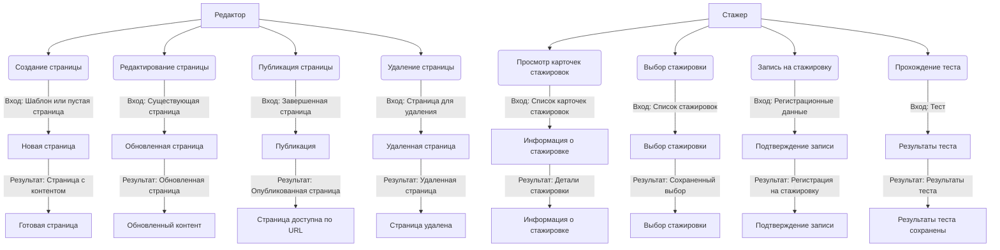

```mermaid
graph TD
  %% Определение ролей
  A[Редактор] --> B(Создание страницы)
  A --> C(Редактирование страницы)
  A --> D(Публикация страницы)
  A --> E(Удаление страницы)

  F[Стажер] --> G(Просмотр карточек стажировок)
  F --> H(Выбор стажировки)
  F --> I(Запись на стажировку)
  F --> J(Прохождение теста)

  %% Входящие и выходящие потоки
  B -->|Вход: Шаблон или пустая страница| K[Новая страница]
  C -->|Вход: Существующая страница| L[Обновленная страница]
  D -->|Вход: Завершенная страница| M[Публикация]
  E -->|Вход: Страница для удаления| N[Удаленная страница]
  
  G -->|Вход: Список карточек стажировок| O[Информация о стажировке]
  H -->|Вход: Список стажировок| P[Выбор стажировки]
  I -->|Вход: Регистрационные данные| Q[Подтверждение записи]
  J -->|Вход: Тест| R[Результаты теста]

  %% Ожидаемые результаты
  K -->|Результат: Страница с контентом| A1[Готовая страница]
  L -->|Результат: Обновленная страница| A2[Обновленный контент]
  M -->|Результат: Опубликованная страница| A3[Страница доступна по URL]
  N -->|Результат: Удаленная страница| A4[Страница удалена]
  
  O -->|Результат: Детали стажировки| F1[Информация о стажировке]
  P -->|Результат: Сохраненный выбор| F2[Выбор стажировки]
  Q -->|Результат: Регистрация на стажировку| F3[Подтверждение записи]
  R -->|Результат: Результаты теста| F4[Результаты теста сохранены]

```
