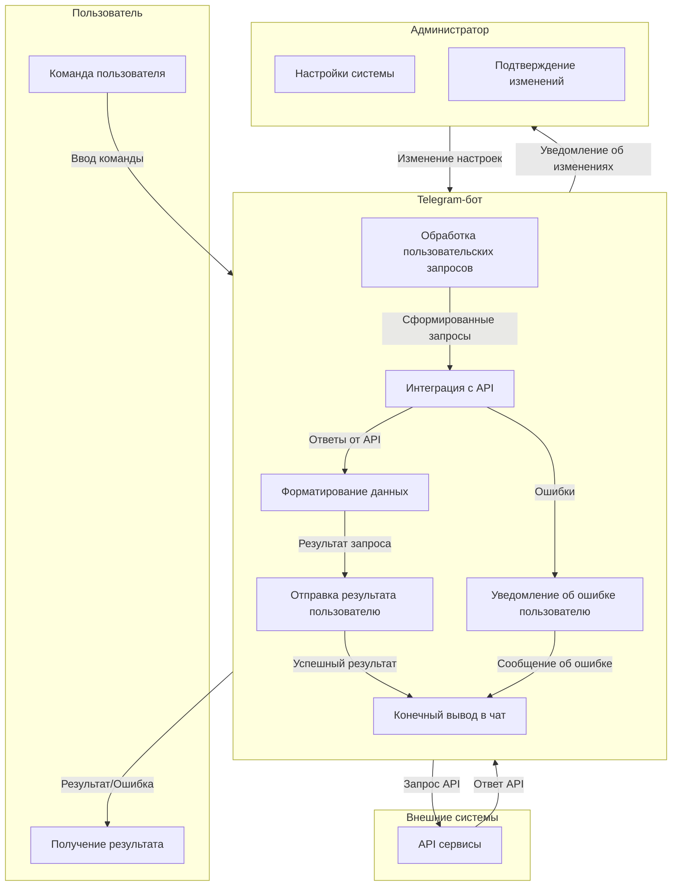

```mermaid
flowchart TD
    subgraph TelegramBot["Telegram-бот"]
        direction TB
        A[Обработка пользовательских запросов] -->|Сформированные запросы| B[Интеграция с API]
        B -->|Ответы от API| C[Форматирование данных]
        C -->|Результат запроса| D[Отправка результата пользователю]
        B -->|Ошибки| E[Уведомление об ошибке пользователю]
        D -->|Успешный результат| F[Конечный вывод в чат]
        E -->|Сообщение об ошибке| F
    end

    subgraph ExternalSystems[Внешние системы]
        direction TB
        API[API сервисы]
    end

    subgraph User[Пользователь]
        direction TB
        U1[Команда пользователя]
        U2[Получение результата]
    end

    subgraph Admin[Администратор]
        direction TB
        A1[Настройки системы]
        A2[Подтверждение изменений]
    end

    %% Связи между компонентами
    U1 -->|Ввод команды| TelegramBot
    TelegramBot -->|Запрос API| API
    API -->|Ответ API| TelegramBot
    TelegramBot -->|Результат/Ошибка| U2
    Admin -->|Изменение настроек| TelegramBot
    TelegramBot -->|Уведомление об изменениях| Admin
```
