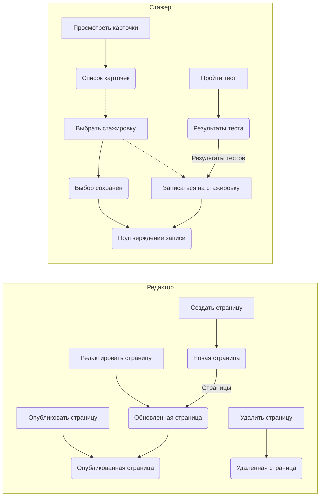

```mermaid
graph LR
    subgraph Редактор
        A[Создать страницу] --> B(Новая страница);
        C[Редактировать страницу] --> D(Обновленная страница);
        E[Опубликовать страницу] --> F(Опубликованная страница);
        G[Удалить страницу] --> H(Удаленная страница);
    end
    subgraph Стажер
        I[Просмотреть карточки] --> J(Список карточек);
        K[Выбрать стажировку] --> L(Выбор сохранен);
        M[Записаться на стажировку] --> N(Подтверждение записи);
        O[Пройти тест] --> P(Результаты теста);
    end
    B -- Страницы --> D --> F
    J -.-> K -.-> M
    L --> N
    P -- Результаты тестов --> M
```
